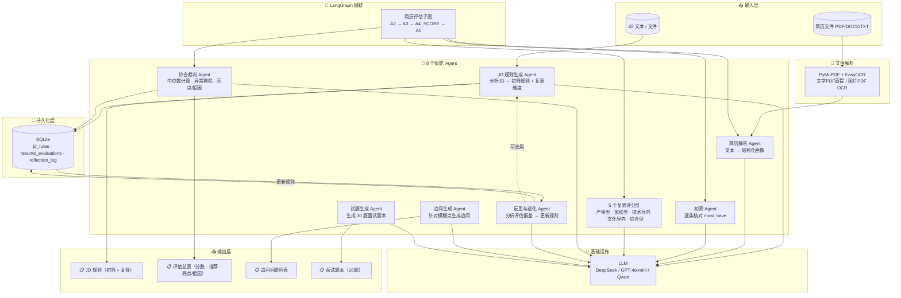
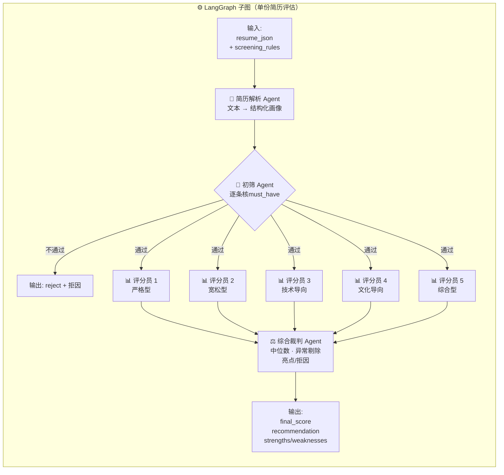
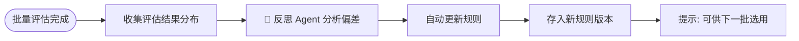

# 🎯 智能简历筛选多智能体系统

基于 **LangGraph** 的多智能体简历筛选系统，实现三阶段交互流程：JD 分析 → 简历批量评估 → 面试准备。

---

## 📑 目录

- [📦 交付物清单](#deliverables)
- [🏗️ 系统架构](#architecture)
  - [整体架构](#overview)
  - [数据流](#dataflow)
- [🧠 Prompt 设计思路](#prompt-design)
  - [设计原则](#prompt-principles)
  - [关键 Prompt 示例](#prompt-examples)
- [🚀 快速启动](#quickstart)
  - [环境要求](#requirements)
  - [1. 安装依赖](#install)
  - [2. 配置 API Key](#configure-key)
  - [3. 启动应用](#run)
- [📁 项目结构](#structure)
- [⚙️ 技术栈](#tech-stack)
- [🛡️ 难点与解决方案](#challenges)
- [🔄 核心工作流](#workflow)
  - [简历评估 LangGraph 子图](#langgraph-workflow)
  - [反思与规则进化](#reflection-evolution)
  - [异常处理机制](#error-handling)
- [📊 使用演示流程](#usage)

---

<a name="deliverables"></a>
## 📦 交付物清单

本仓库包含以下交付内容：

1. **可运行的源代码** — 克隆后按步骤即可启动 Demo
2. **演示视频** — 完整演示从输入到输出的全过程：

   <video src="https://github.com/ywj-code/recruiter/raw/main/demo_video.mp4" controls width="100%"></video>
3. **设计文档（本 README）** — 包含架构图、Prompt 设计思路、难点与解决方案

---

<a name="architecture"></a>
## 🏗️ 系统架构

<a name="overview"></a>
### 整体架构



<a name="dataflow"></a>
### 数据流

```
JD 文本 ──→ JD规则生成Agent ──→ 初筛规则(must_have) + 复筛规则(维度+权重)
                                        │
简历文件 ──→ 文件解析(PDF/DOCX/TXT) ──→ 简历解析Agent ──→ 结构化画像
                                        │
                    ┌── 初筛Agent ── 不通过 ──→ 直接标记 reject
                    │        │
                    │    通过初筛
                    │        │
                    │   ┌────┴────┐
                    │   │ 评分员1 │  (严格型)
                    │   │ 评分员2 │  (宽松型)
                    │   │ 评分员3 │  (技术导向)
                    │   │ 评分员4 │  (文化导向)
                    │   │ 评分员5 │  (综合型)   ← 5个并行
                    │   └────┬────┘
                    │   ┌────┴────┐
                    │   │综合裁判  │  → 最终分数 + 推荐状态 + 亮点/拒因
                    │   └─────────┘
                    │        │
                    │  存入 SQLite ──→ 展示评估总表
                    │
批量评估结束 ──→ 反思Agent ──→ 分析偏差 ──→ 自动更新规则（新版本）
```

---

<a name="prompt-design"></a>
## 🧠 Prompt 设计思路

<a name="prompt-principles"></a>
### 设计原则

所有 Prompt 集中在 `utils/prompts.py`，按 Agent 功能独立管理，遵循以下设计哲学：

#### 1. 角色锚定（Role Anchoring）
每个 Prompt 开头明确设定专家角色，让 LLM 进入特定思维模式：
- JD 规则生成 → "资深招聘分析专家"
- 综合裁判 → "招聘仲裁专家"
- 反思进化 → "招聘系统优化专家"

#### 2. 结构化输出约束（Structured Output）
- 全部使用 JSON 输出模式 + 严格的 schema 定义
- 每个 Prompt 末尾强调"输出严格 JSON 格式，不包含任何额外文本"
- 配合代码层的 JSON 解析回退机制，当 LLM 输出格式异常时使用默认值

#### 3. 分步推理链（Chain of Thought）
多处 Prompt 内嵌分析步骤，引导 LLM 按顺序思考：
```
JD_AGENT: 分析 JD 核心要求 → 设计初筛规则 → 设计复筛维度
SCORER:  寻找证据 → 对照标准 → 赋分 → 加权 → 撰写理由 → 置信度
```

#### 4. 分数锚定（Score Calibration）
为评分员提供明确的分数区间参考，减少输出漂移：
```
0-25: 几乎无证据    26-50: 明显不满足    51-70: 基本满足
71-85: 较好满足     86-100: 突出匹配
```

#### 5. 异常值过滤 + 规则兜底（Fallback）
综合裁判 Agent 的 Prompt 只负责文本润色（提取亮点/拒因），所有算术逻辑（中位数计算、异常剔除、推荐状态判定）在代码层完成，LLM 输出结果被代码层结果覆盖，确保最终结论不依赖 LLM 的算术能力。

<a name="prompt-examples"></a>
### 关键 Prompt 示例

**初筛条件生成策略（JD_AGENT_SYSTEM_PROMPT 的核心约束）**：
```
只有 JD 中明确表述为"必须满足"的条件（含"必备"、"必须"、"硬性要求"等信号词）
才放入 must_have 列表；模糊的任职要求描述全部放到复筛评分维度中。
如果整篇 JD 没有"必须"信号，must_have 为空列表。
```

**反思进化（REFLECTION_SYSTEM_PROMPT 的分析框架）**：
```
1. 误杀检测：初筛未过但复筛高分 → 条件过严
2. 过松检测：初筛通过率 >90% → 条件过松
3. 区分度：维度评分方差 <10 → 无区分度
4. 共识度：评分员分差 >30 → 标准不清晰
```

---

<a name="quickstart"></a>
## 🚀 快速启动

<a name="requirements"></a>
### 环境要求
- Python 3.10+
- 一个 LLM API Key（支持 OpenAI / DeepSeek / Qwen）

<a name="install"></a>
### 1. 安装依赖

```bash
cd recruiter
pip install -r requirements.txt
```

<a name="configure-key"></a>
### 2. 配置 API Key

```bash
cp .env.example .env
```

编辑 `.env` 文件，填入你的 API Key。支持以下任意一种：

```env
# 方案一：OpenAI (GPT-4o-mini)
LLM_PROVIDER=openai
OPENAI_API_KEY=sk-your-key

# 方案二：DeepSeek（推荐，性价比高）
LLM_PROVIDER=deepseek
DEEPSEEK_API_KEY=sk-your-key

# 方案三：通义千问
LLM_PROVIDER=qwen
QWEN_API_KEY=sk-your-key
```

<a name="run"></a>
### 3. 启动应用

```bash
streamlit run app.py
```

浏览器打开 `http://localhost:8501`

---

<a name="structure"></a>
## 📁 项目结构

```
recruiter/
├── README.md                     # 设计文档
├── requirements.txt              # Python 依赖
├── .env.example                  # 环境变量模板
├── app.py                        # Streamlit 主程序（三页路由）
├── agents/                       # 智能体模块（8个 Agent）
│   ├── jd_agent.py               # JD 规则生成 Agent
│   ├── resume_parser.py          # 简历解析 Agent
│   ├── prefilter.py              # 初筛 Agent
│   ├── scorers.py                # 5个复筛评分员 Agent（并行）
│   ├── judge.py                  # 综合裁判 Agent
│   ├── reflection.py             # 反思与进化 Agent
│   ├── followup.py               # 追问生成 Agent
│   └── question_gen.py           # 试题生成 Agent
├── graph/                        # LangGraph 工作流
│   ├── state.py                  # 状态定义 (TypedDict)
│   └── workflow.py               # 评估工作流图构建
├── storage/                      # 持久化存储
│   ├── db.py                     # SQLite 初始化与 CRUD
│   └── models.py                 # Pydantic 数据模型
├── utils/                        # 工具函数
│   ├── llm_client.py             # 统一 LLM 客户端（多提供商支持）
│   ├── file_parser.py            # 文件解析（PDF 文字/图片/DOCX/TXT）
│   ├── prompts.py                # 所有 Prompt 模板（集中管理）
│   └── validators.py             # 数据校验
└── models/easyocr/               # EasyOCR 本地模型目录（需自行下载）
```

---

<a name="tech-stack"></a>
## ⚙️ 技术栈

| 层级 | 使用技术 |
|------|---------|
| **LLM** | DeepSeek / GPT-4o-mini / Qwen-turbo（OpenAI 兼容 API，可无缝切换） |
| **Agent 编排** | LangGraph + LangChain |
| **前端** | Streamlit（三页面交互） |
| **数据存储** | SQLite（三张表：规则、评估、反思日志） |
| **文档解析** | PyMuPDF + EasyOCR（图片型 PDF 自动 OCR） + python-docx |
| **数据模型** | Pydantic v2 |
| **开发辅助** | 本项目开发过程中使用了 AI 编程辅助工具提升效率 |

---

<a name="challenges"></a>
## 🛡️ 难点与解决方案

### 难点 1：评分员输出不一致
**问题**：5 位评分员各自调用 LLM，打分基准差异大，导致综合裁判结果不稳定。

**解决**：
- 所有 prompt 内嵌统一的分数锚点表（0-25/26-50/51-70/71-85/86-100），缩小打分漂移
- 综合裁判采用**规则 + LLM 双层架构**：
  - 规则层：计算中位数、剔除与中位数差 >30 且置信度低的异常评分
  - LLM 层：只负责从评分员评语中提取亮点/拒因文本
  - 最终分数和推荐状态由代码层强制覆盖 LLM 输出

### 难点 2：图片型 PDF 的文本提取
**问题**：扫描版简历（图片 PDF）无法直接用文本提取库解析。

**解决**：
- 集成 PyMuPDF + EasyOCR，逐页检测文字层
- 有文字层的页面直接提取，无文字层的页面自动渲染为图片后 OCR
- EasyOCR Reader 采用单例模式，避免重复加载模型

### 难点 3：初筛规则误生成
**问题**：LLM 容易把 JD 中的普通任职要求（如"熟悉 Python"）误当作硬性条件，导致误筛候选人。

**解决**：
- Prompt 中加入明确的信号词判断规则：只有带"必须/必备/硬性要求"等关键词的条件才放入 must_have
- 模糊条件自动归入复筛评分维度
- 默认回退值为空列表，宁可放过也不要误杀

### 难点 4：批量处理效率
**问题**：10 份简历串行评估约需 2 分钟，用户体验差。

**解决**：
- 两层并行：简历间并行（ThreadPoolExecutor，默认 12 份同时）+ 评分员间并行（5 个评分员同时打分）
- 10 份简历评估时间从 2 分钟降至约 15 秒

---

<a name="workflow"></a>
## 🔄 核心工作流

<a name="langgraph-workflow"></a>
### 简历评估 LangGraph 子图（多 Agent 协同）



<a name="reflection-evolution"></a>
### 反思与规则进化



<a name="error-handling"></a>
### 异常处理机制

- 所有 LLM 调用自动重试（最多 2 次），JSON 解析失败使用默认值
- 初筛 Agent 无法判断时默认 pass（宽容策略）
- 评分员不足 2 个时，最终分数 = 50，推荐 = consider
- 反思需要至少 3 份评估结果
- 待定候选人支持**人工干预**：面试官可手动升级为推荐或降级为不推荐，结果持久化到数据库

---

<a name="usage"></a>
## 📊 使用演示流程

1. 上传 JD（PDF/DOCX/TXT）或手动输入 JD 文本
2. 点击「分析 JD 并生成规则」→ 系统自动生成初筛规则和复筛维度
3. 审核并调整规则（添加/删除条件、调整维度权重）
4. 点击「确认规则并保存」→ 进入下一步
5. 批量上传简历文件（支持多文件，PDF/DOCX/TXT）
6. 点击「开始评估所有简历」→ 并行评估，实时进度条
7. 查看评估总表：匹配分、推荐状态、亮点/拒因一目了然
8. 点击某候选人的「详情」→ 查看 5 位评分员详细打分和理由
9. 对**待定**候选人：可在详情页手动**升级为推荐**或**降级为不推荐**，记录人工判定理由
10. 对推荐面试的候选人，点击「生成追问问题」和「生成面试题本」
11. 点击「反思并更新规则」→ 自动分析偏差，生成新版本规则（可在步骤一历史规则中选用）

---

> 开发过程中使用了 AI 编程辅助工具提升效率。
